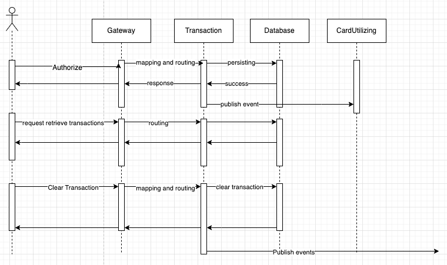
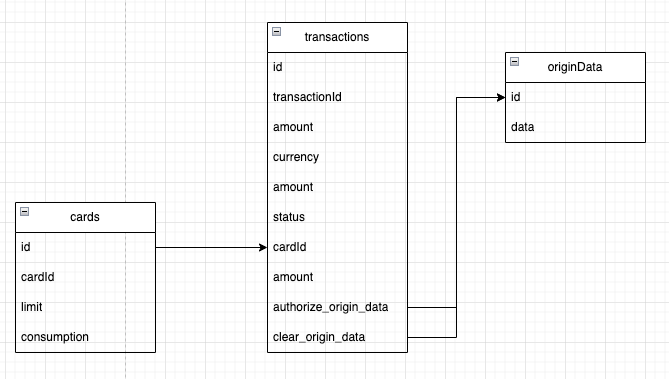
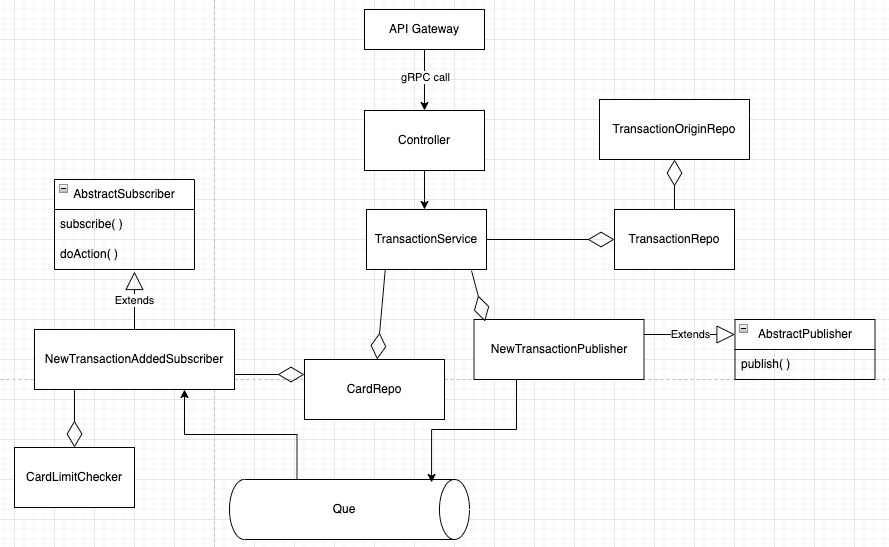

# Pemo
Coding challenge

## The problem:
At Pemo, we manage transactions from multiple processors, each having unique transaction structures. We aim to create a scalable solution capable of effortlessly accommodating an unlimited number of processors.
Your task is to design a system to realize this objective. The solution should encompass a software design as well as the implementation of two services using NestJS, Sequelize, Postgres,
and gRPC.

## Sequence Diagram:

## ERD:
We have three tables:
- Cards:
  - It contains the card details, and take care of limit and the consumption.
- transactions:
  - Contains the transaction data, the format that Pemo accept, not the coming from the processors.
- OriginData:
  - Contains the processor origin transaction data.
  - The origin data is not stored within the transaction, as it will rarely be  called, so there is no need to added it within the transaction.

## Class diagram
We keep in mind to apply SOLID principles while we design the class diagram.
Classes Responsibilities:
- Controller:
  - responsible for format validation, and delegate the request to the service.
- CardLimitChecker:
  - It checks the card limit exceed, will be used before publish a message that the card is exceeded
- AbstractPublisher:
  - Is the base class for all publisher types for example, NewTransactionPublisher
- NewTransactionPublisher:
  - Publish a message when a new transaction is added.
- AbstractSubscriber:
  - Is the base class for all subscribers, for example NewTransactionAddedSubscriber
- NewTransactionAddedSubscriber:
  - It will do adding new transaction consequences for example checking card limit and notify user if the limit is exceeded.

